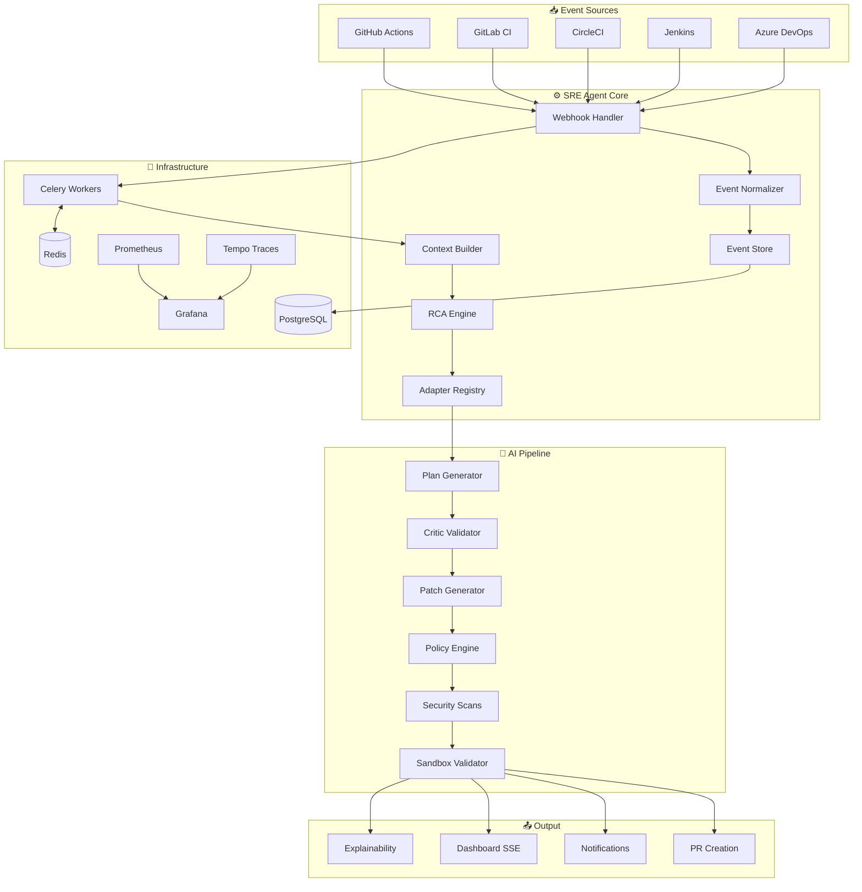

<p align="center">
  
</p>

<p align="center">
  
</p>

<p align="center">
  
  
  
</p>

<p align="center">
  <a href="#-features"></a>
  <a href="#-architecture"></a>
  <a href="#-features"></a>
  <a href="#-features"></a>
</p>

<p align="center">
  
  
  
  
</p>

<br>

<div align="center">

  **🚧 This project is actively under development. Features may change. Contributions welcome!**

</div>

<br>

---

<br>

## 📋 Table of Contents

<details>
<summary>Click to expand</summary>

- [🌟 Overview](#-overview)
- [✨ Key Features](#-key-features)
- [🆕 What's New — Complete Feature Breakdown](#-whats-new--complete-feature-breakdown)
- [🏗️ Architecture](#️-architecture)
- [🚀 Quick Start](#-quick-start)
- [🔌 API Reference](#-api-reference)
- [⚙️ Configuration](#️-configuration)
- [🧪 Testing & Evaluation](#-testing--evaluation)
- [📁 Project Structure](#-project-structure)
- [🗺️ Roadmap](#️-roadmap)
- [🤝 Contributing](#-contributing)
- [📄 License](#-license)

</details>

<br>

---

<br>

## 🌟 Overview

<div align="center">

### **No more 3 AM debugging sessions. Let the AI agent fix your builds while you sleep.**

</div>

<br>

The **Autonomous AI-powered SRE Agent** is a cutting-edge platform that revolutionizes how engineering teams handle CI/CD failures. It monitors your CI/CD pipelines across **5 major providers**, automatically detects failures, performs AI-powered root cause analysis, generates safe code fixes, validates them in isolated sandboxes, and creates detailed pull requests — all **autonomously**.

<table>
<tr>
<td width="50%" valign="top">

### 🎯 The Problem

- ⏰ Hours spent debugging CI/CD failures
- 🔄 Repetitive manual fixes for similar issues
- 😴 Late-night on-call pages
- 📉 Developer productivity drain
- 🔍 Root cause analysis is time-consuming

</td>
<td width="50%" valign="top">

### ✅ Our Solution

- 🔍 **Detects** failures in real-time via webhooks from 5 CI providers
- 🧠 **Diagnoses** root causes with AI-powered semantic log analysis
- 🔧 **Generates** safe, context-aware fixes for 5 languages
- ✅ **Validates** in isolated Docker sandboxes with security scanning
- 🚀 **Creates** detailed Pull Requests with confidence scores & evidence

</td>
</tr>
</table>

<br>

---

<br>

## ✨ Key Features

<br>

<table>
<tr>
<td align="center" width="25%">

<br><br>
<b>🎯 Multi-Provider Detection</b>
<br><br>
Real-time webhooks from GitHub Actions, GitLab CI, CircleCI, Jenkins & Azure DevOps
</td>
<td align="center" width="25%">

<br><br>
<b>🧠 AI-Powered RCA</b>
<br><br>
Semantic log analysis with ML embeddings (FAISS + Sentence Transformers) and pattern matching
</td>
<td align="center" width="25%">

<br><br>
<b>🛠️ Autonomous Fixes</b>
<br><br>
LLM-powered code generation for Python, Node.js, Go, Java & Docker with line-level precision
</td>
<td align="center" width="25%">

<br><br>
<b>🏖️ Sandbox Validation</b>
<br><br>
Isolated Docker environments with gitleaks, trivy & SBOM scanning before any PR
</td>
</tr>
</table>

<br>

<table>
<tr>
<td align="center" width="25%">

<br><br>
<b>📋 Smart PR Management</b>
<br><br>
Auto-generated PRs with changelogs, confidence scores, danger labels & provenance artifacts
</td>
<td align="center" width="25%">

<br><br>
<b>🔐 Enterprise Security</b>
<br><br>
JWT + GitHub/Google OAuth, RBAC, audit logging, CSRF protection & rate limiting
</td>
<td align="center" width="25%">

<br><br>
<b>📊 Modern Dashboard</b>
<br><br>
React 18 + TypeScript with real-time SSE streaming, dark mode & failure detail views
</td>
<td align="center" width="25%">

<br><br>
<b>📈 Full Observability</b>
<br><br>
Prometheus metrics, Grafana dashboards, OpenTelemetry tracing & Tempo integration
</td>
</tr>
</table>

<br>

---

<br>

## 🆕 What's New — Complete Feature Breakdown

<br>

<table>
<tr>
<td>

### 🔗 5 CI/CD Provider Integrations
**Connect your entire pipeline ecosystem**

- ✅ **GitHub Actions** — Full webhook verification, workflow_run/job events, log fetching
- ✅ **GitLab CI** — Pipeline and job event webhooks with token validation
- ✅ **CircleCI** — Job completion webhooks with HMAC signature verification
- ✅ **Jenkins** — Build notification webhooks with token-based auth
- ✅ **Azure DevOps** — Build/release webhooks with Basic auth verification
- ✅ Unified event normalization layer across all providers
- ✅ GitHub Action marketplace support (`action.yml`) for direct workflow integration

</td>
<td>

### 🌍 5 Multi-Language Adapters
**Deterministic fix generation for your stack**

- ✅ **Python** — pip/poetry dependency resolution, import fixes, syntax repairs
- ✅ **Node.js** — npm/yarn package management, module resolution, config fixes
- ✅ **Go** — go.mod/go.sum dependency management, build error fixes
- ✅ **Java** — Maven/Gradle dependency resolution, compilation error fixes
- ✅ **Docker** — Dockerfile instruction fixes, base image updates, build stage repairs
- ✅ Automatic adapter selection based on log analysis and repository file detection
- ✅ Adapter registry with pluggable architecture for easy extension

</td>
</tr>
<tr>
<td>

### 🔐 Authentication & Authorization
**Enterprise-grade multi-provider security**

- ✅ JWT-based authentication (access + refresh tokens via HttpOnly cookies)
- ✅ GitHub OAuth login with state validation, CSRF protection & scope verification
- ✅ Google OAuth integration
- ✅ Email/password registration with secure session management
- ✅ Role-based access control (RBAC) with granular permissions
- ✅ Redis-backed session management with configurable TTLs
- ✅ Comprehensive audit logging for all auth events

</td>
<td>

### 📢 5-Channel Notification System
**Never miss a critical event**

- ✅ **Slack** — Rich Block Kit messages, dedicated channels for alerts/critical/approvals
- ✅ **Microsoft Teams** — Adaptive Card notifications with action buttons
- ✅ **Email** — SMTP and SendGrid support with HTML templates
- ✅ **PagerDuty** — Incident creation/resolution with severity-based routing
- ✅ **Generic Webhook** — Bearer/Basic/HMAC auth for custom integrations
- ✅ Parallel dispatch with rate limiting and configurable minimum severity
- ✅ Pluggable factory pattern for adding custom notification channels

</td>
</tr>
<tr>
<td>

### 🧾 Explainability + Trust Dashboard
**Evidence-based failure analysis with full transparency**

- ✅ Root cause + log evidence with line indices and tags
- ✅ Patch preview (unified diff) with DiffViewer component
- ✅ FixPlan JSON preview with interactive JsonViewer
- ✅ Danger score breakdown + policy violations surfaced
- ✅ Scan summaries (gitleaks/trivy/SBOM + sandbox status)
- ✅ Provenance artifact viewer with full pipeline timeline
- ✅ Severity badges and visual risk indicators

</td>
<td>

### 📊 Production Observability Stack
**Complete monitoring, metrics, and distributed tracing**

- ✅ Prometheus metrics at `/metrics` (HTTP request rates, durations, pipeline outcomes)
- ✅ 4 pre-built Grafana dashboards: API Health, Pipeline Overview, Safety & Risk, Security
- ✅ OpenTelemetry tracing via OTLP with spans for every pipeline stage
- ✅ Tempo trace storage with Grafana Explore integration
- ✅ Correlation ID middleware linking logs ↔ metrics ↔ traces
- ✅ Key metrics: webhook dedup, pipeline runs/retries/throttled, policy violations
- 📖 [Docs: observability.md](docs/observability.md)

</td>
</tr>
<tr>
<td>

### 🖥️ React Dashboard & Landing Page
**Modern, full-featured web interface**

- ✅ React 18 + TypeScript + Vite with hot module replacement
- ✅ Landing page with hero section, feature blocks & GitHub login CTA
- ✅ Real-time dashboard with SSE event streaming (13 event types)
- ✅ Interactive failure detail views with log evidence
- ✅ DiffViewer, JsonViewer, Timeline, and SeverityBadge components
- ✅ Dark mode support with responsive design
- ✅ Session guard layer with automatic redirect on JWT expiry
- ✅ OAuth callback handler for GitHub login flow

</td>
<td>

### ⚡ Pipeline Reliability & Operations
**Production-grade resilience and safety**

- ✅ Idempotent webhook ingestion (duplicate deliveries ignored)
- ✅ Redis-locked concurrent pipeline execution per repo
- ✅ Configurable concurrency limits (default: 2 per repo)
- ✅ Exponential backoff retries with cooldown periods
- ✅ Loop protection — blocks PR churn after max attempts
- ✅ Per-repo webhook rate limiting (default: 30/min)
- ✅ Post-merge monitoring with automatic re-validation
- ✅ Incident playbooks for webhook storms, queue backlogs & scanner failures
- 📖 [Docs: ops.md](docs/ops.md)

</td>
</tr>
<tr>
<td>

### 🔒 Safety & Security Engine
**Multi-layered protection against unsafe changes**

- ✅ Configurable safety policy (`config/safety_policy.yaml`)
- ✅ Dual policy checks — plan-level AND patch-level validation
- ✅ Danger score computation with breakdown per risk factor
- ✅ Path allow/deny lists (protect critical infrastructure files)
- ✅ Secret detection patterns (blocks API keys, passwords, tokens)
- ✅ Patch size limits (max files, lines added, lines removed)
- ✅ Critic model validation — checks reasoning before execution
- ✅ Supply-chain scanning: gitleaks (secrets), trivy (vulnerabilities), syft (SBOM)
- ✅ PRs labeled `safe` or `needs-review` based on danger score threshold

</td>
<td>

### 🧪 Real-Time Test Harness
**End-to-end SRE loop validation**

- ✅ Controlled failure-prone sample repository with GitHub Actions CI
- ✅ Automated failure scenario injection (push branch → CI fails → webhook → fix → PR)
- ✅ Testing Agent with API-driven subsystem validators
- ✅ Per-scenario and aggregate structured JSON reports
- ✅ Support for running all failures or selective subsets (`--failures 1,4,7`)
- ✅ Cleanup mode to remove test GitHub repos after validation
- ✅ Makefile convenience commands (`setup`, `dry-run`)
- 📖 [Docs: test-harness/README.md](test-harness/README.md)

</td>
</tr>
<tr>
<td>

### 🔌 GitHub App & Repo Integration
**Seamless onboarding and repository configuration**

- ✅ GitHub App installation flow with state persistence
- ✅ Repository selector with permission validation (admin/maintain)
- ✅ Per-repo `.sre-agent.yaml` configuration file support
- ✅ Automation modes: `suggest`, `auto_pr`, `auto_merge`
- ✅ Protected paths — directories that must never be modified
- ✅ Configurable retry limits per repository
- ✅ Onboarding state tracking (oauth → repo_selected → app_installed → dashboard_ready)
- 📖 [Docs: phase1_onboarding.md](docs/phase1_onboarding.md)

</td>
<td>

### 📈 Offline Evaluation Harness
**Quantified fix quality with structured metrics**

- ✅ 35 curated test cases across multiple failure categories
- ✅ Mock LLM mode for deterministic, reproducible evaluations
- ✅ Metrics: Fix Success Rate, Safe Fix Rate, Average Danger Score, Mean Time to Repair
- ✅ Structured results output to `evals/results/`
- ✅ CLI: `python -m evals.run --limit 35 --model mock --out evals/results/run_local`

</td>
</tr>
</table>

<br>

---

<br>

## 🏗️ Architecture

<br>



<br>

### 🔄 8-Step Deterministic Fix Pipeline

```
┌─────────────────────────────────────────────────────────────────────────────────┐
│                         DETERMINISTIC FIX PIPELINE                              │
├─────────────────────────────────────────────────────────────────────────────────┤
│                                                                                 │
│  ┌──────────┐   ┌──────────┐   ┌──────────┐   ┌──────────┐                    │
│  │ 1.ADAPTER │──▶│ 2. PLAN  │──▶│ 3. PLAN  │──▶│ 4.PATCH  │                   │
│  │  SELECT   │   │(LLM→JSON)│   │  SAFETY  │   │(Diff Gen)│                   │
│  └──────────┘   └──────────┘   └──────────┘   └──────────┘                    │
│       │              │              │              │                            │
│       ▼              ▼              ▼              ▼                            │
│   Language       Fix Plan      Policy Check    Unified Diff                     │
│   Detection      JSON Only     Intent Eval     Constrained                      │
│                                                                                 │
│  ┌──────────┐   ┌──────────┐   ┌──────────┐   ┌──────────┐                    │
│  │ 5. PATCH │──▶│ 6. SCAN  │──▶│  7. TEST  │──▶│ 8. PR    │                   │
│  │  SAFETY  │   │(Security)│   │ (Sandbox) │   │(Creation)│                   │
│  └──────────┘   └──────────┘   └──────────┘   └──────────┘                    │
│       │              │              │              │                            │
│       ▼              ▼              ▼              ▼                            │
│   Path/Secret    gitleaks      Tests Pass?     safe / needs-review              │
│   Size Limits    trivy/SBOM    ────────────    Provenance Attached              │
│   Danger Score   Secrets Scan  If YES → PR                                      │
│                                If NO → Alert                                    │
└─────────────────────────────────────────────────────────────────────────────────┘
```

<br>

### 🛠️ Tech Stack

<table>
<tr>
<th>Layer</th>
<th>Technology</th>
<th>Purpose</th>
</tr>
<tr>
<td><b>🌐 API</b></td>
<td></td>
<td>Async REST API framework with auto-generated docs</td>
</tr>
<tr>
<td><b>🖥️ Frontend</b></td>
<td>  </td>
<td>Modern reactive UI with SSE streaming & dark mode</td>
</tr>
<tr>
<td><b>⚡ Task Queue</b></td>
<td> </td>
<td>Async pipeline processing with concurrency locking</td>
</tr>
<tr>
<td><b>💾 Database</b></td>
<td> </td>
<td>Event store, pipeline runs, audit logs with migrations</td>
</tr>
<tr>
<td><b>🧠 AI/LLM</b></td>
<td> </td>
<td>Fix plan generation (JSON-only output with critic validation)</td>
</tr>
<tr>
<td><b>🔍 Embeddings</b></td>
<td> </td>
<td>Semantic log analysis & knowledge base retrieval</td>
</tr>
<tr>
<td><b>🔒 Security</b></td>
<td>  </td>
<td>Secrets detection, vulnerability scanning, SBOM generation</td>
</tr>
<tr>
<td><b>📊 Observability</b></td>
<td>   </td>
<td>Metrics, dashboards, distributed tracing, trace storage</td>
</tr>
<tr>
<td><b>🐳 Container</b></td>
<td> </td>
<td>Containerization, orchestration & sandbox isolation</td>
</tr>
</table>

<br>

---

<br>

## 🚀 Quick Start

<br>

### Prerequisites

<table>
<tr>
<td>✅</td>
<td><b>Python 3.11+</b></td>
<td>Core runtime</td>
</tr>
<tr>
<td>✅</td>
<td><b>Docker & Docker Compose</b></td>
<td>Container orchestration & sandbox</td>
</tr>
<tr>
<td>✅</td>
<td><b>Poetry</b></td>
<td>Python dependency management</td>
</tr>
<tr>
<td>✅</td>
<td><b>Node.js 18+</b></td>
<td>Frontend development</td>
</tr>
<tr>
<td>✅</td>
<td><b>GitHub PAT</b></td>
<td>API access for webhooks & log fetching</td>
</tr>
</table>

<br>

### 🐳 Option 1: Docker (Recommended)

```bash
# Clone the repository
git clone https://github.com/Mrgig7/Autonomous-Al-powered-SRE-Agent.git
cd Autonomous-Al-powered-SRE-Agent

# Configure environment
cp .env.example .env
# Edit .env with your GitHub token and settings

# Start all services (API, Worker, DB, Redis, Prometheus, Grafana, Tempo, OTel)
docker-compose up -d

# Optional: Start with frontend
docker-compose --profile with-frontend up -d

# Optional: Start with local LLM (requires GPU)
docker-compose --profile local-llm up -d

# Check status
docker-compose ps
```

<br>

### 💻 Option 2: Local Development

```bash
# Clone the repository
git clone https://github.com/Mrgig7/Autonomous-Al-powered-SRE-Agent.git
cd Autonomous-Al-powered-SRE-Agent

# Configure environment
cp .env.example .env

# Start infrastructure
docker-compose up -d postgres redis

# Install Python dependencies
poetry install

# Run database migrations
poetry run alembic upgrade head

# Terminal 1: Start API server
poetry run uvicorn sre_agent.main:app --reload --host 0.0.0.0 --port 8000

# Terminal 2: Start Celery worker
poetry run celery -A sre_agent.celery_app worker --loglevel=info

# Terminal 3: Start frontend
cd frontend && npm ci && npm run dev
```

<br>

### 🌐 Access Points

| Service | URL | Description |
|---------|-----|-------------|
| 🖥️ **Dashboard** | http://localhost:3000 | React frontend with SSE streaming |
| 📚 **API Docs** | http://localhost:8000/docs | Swagger UI (auto-generated) |
| 📊 **Prometheus** | http://localhost:9090 | Metrics & alerting |
| 📈 **Grafana** | http://localhost:3001 | Dashboards & trace explorer (admin/admin) |
| 🔍 **Tempo** | http://localhost:3200 | Distributed trace storage |
| 📉 **Metrics** | http://localhost:8000/metrics | Raw Prometheus metrics endpoint |

<br>

### 🎮 GitHub Action Usage

Add the SRE Agent to your workflow for automatic failure analysis:

```yaml
# .github/workflows/sre-agent.yml
name: SRE Agent Analysis
on:
  workflow_run:
    workflows: ["CI"]
    types: [completed]

jobs:
  analyze:
    if: ${{ github.event.workflow_run.conclusion == 'failure' }}
    runs-on: ubuntu-latest
    steps:
      - uses: Mrgig7/Autonomous-Al-powered-SRE-Agent@main
        with:
          github-token: ${{ secrets.GITHUB_TOKEN }}
          auto-create-pr: 'true'
          notify-slack: 'true'
          slack-webhook-url: ${{ secrets.SLACK_WEBHOOK_URL }}
```

<br>

---

<br>

## 🔌 API Reference

<br>

### Webhook Endpoints

| Method | Endpoint | Description |
|--------|----------|-------------|
| `POST` | `/webhooks/github` | GitHub Actions webhook receiver |
| `POST` | `/webhooks/gitlab` | GitLab CI webhook receiver |
| `POST` | `/webhooks/circleci` | CircleCI webhook receiver |
| `POST` | `/webhooks/jenkins` | Jenkins webhook receiver |
| `POST` | `/webhooks/azure-devops` | Azure DevOps webhook receiver |

### Core Endpoints

<details>
<summary><b>🏥 Health Check</b></summary>

```http
GET /health
```

**Response:**
```json
{
  "status": "healthy",
  "version": "1.0.0",
  "database": "connected",
  "redis": "connected"
}
```
</details>

<details>
<summary><b>🔍 Get Failure Analysis</b></summary>

```http
GET /api/v1/failures/{failure_id}/analysis
```

Returns root cause, category, confidence score, and evidence lines.
</details>

<details>
<summary><b>🧾 Get Explanation (Explainability)</b></summary>

```http
GET /api/v1/failures/{failure_id}/explain
```

Returns evidence-based failure explanation with root cause, log evidence with line indices, danger score breakdown, and policy violations.
</details>

<details>
<summary><b>📜 Get Provenance Artifact</b></summary>

```http
GET /api/v1/runs/{run_id}/artifact
```

Returns full provenance including plan JSON, policy decisions, scan results (gitleaks, trivy, SBOM), and validation results.
</details>

<details>
<summary><b>📊 Dashboard Stream (SSE)</b></summary>

```http
GET /api/v1/dashboard/stream
```

Server-Sent Events stream with 13 event types: `ingest`, `context`, `rca`, `fix_pipeline`, `adapter_select`, `plan`, `policy_plan`, `clone`, `patch`, `policy_patch`, `validate`, `pr_create`, `pipeline`.
</details>

### Auth Endpoints

| Method | Endpoint | Description |
|--------|----------|-------------|
| `POST` | `/api/v1/auth/register` | User registration |
| `POST` | `/api/v1/auth/login` | Email/password login |
| `POST` | `/api/v1/auth/github/login` | GitHub OAuth start/exchange |
| `POST` | `/api/v1/auth/logout` | Session logout |
| `GET` | `/api/v1/users/me` | Get current user profile |
| `GET` | `/api/v1/user/repos` | List GitHub repositories |
| `POST` | `/api/v1/integration/install` | Start GitHub App installation |
| `POST` | `/api/v1/integration/install/confirm` | Confirm GitHub App installation |

<br>

📖 **Full API documentation:** http://localhost:8000/docs

<br>

---

<br>

## ⚙️ Configuration

<br>

### Environment Variables

The `.env.example` file contains **156 configurable options** organized into sections:

| Section | Key Variables | Description |
|---------|--------------|-------------|
| **Core** | `GITHUB_TOKEN`, `GITHUB_WEBHOOK_SECRET` | GitHub API access & webhook verification |
| **Database** | `DATABASE_URL`, `REDIS_URL` | PostgreSQL and Redis connections |
| **LLM** | `LLM_PROVIDER`, `OLLAMA_MODEL`, `OLLAMA_BASE_URL` | AI model configuration (ollama/mock) |
| **Auth** | `JWT_SECRET_KEY`, `GITHUB_OAUTH_CLIENT_ID/SECRET` | Authentication & OAuth settings |
| **Google OAuth** | `GOOGLE_OAUTH_CLIENT_ID/SECRET` | Google login integration |
| **Sandbox** | `SANDBOX_DOCKER_IMAGE`, `ENABLE_SCANS`, `FAIL_ON_SECRETS` | Sandbox & security scanning |
| **Slack** | `SLACK_ENABLED`, `SLACK_WEBHOOK_URL`, `SLACK_BOT_TOKEN` | Slack notification channel |
| **Teams** | `TEAMS_ENABLED`, `TEAMS_WEBHOOK_URL` | Microsoft Teams notifications |
| **Email** | `EMAIL_ENABLED`, `SMTP_HOST`, `SENDGRID_API_KEY` | Email notifications (SMTP/SendGrid) |
| **PagerDuty** | `PAGERDUTY_ENABLED`, `PAGERDUTY_ROUTING_KEY` | Incident management integration |
| **Webhook** | `WEBHOOK_ENABLED`, `WEBHOOK_URL`, `WEBHOOK_AUTH_TYPE` | Generic webhook notifications |
| **GitLab** | `GITLAB_ENABLED`, `GITLAB_TOKEN` | GitLab CI provider |
| **CircleCI** | `CIRCLECI_ENABLED`, `CIRCLECI_TOKEN` | CircleCI provider |
| **Jenkins** | `JENKINS_ENABLED`, `JENKINS_URL`, `JENKINS_TOKEN` | Jenkins provider |
| **Azure DevOps** | `AZURE_DEVOPS_ENABLED`, `AZURE_DEVOPS_PAT` | Azure DevOps provider |
| **Reliability** | `MAX_PIPELINE_ATTEMPTS`, `COOLDOWN_SECONDS` | Retry/backoff/loop protection |
| **Phase Flags** | `PHASE1_ENABLE_DASHBOARD`, `PHASE1_ENABLE_INSTALL_FLOW` | Feature flag toggles |

<br>

### 🛡️ Safety Policy

```yaml
# config/safety_policy.yaml
paths:
  allowed:
    - "src/**"
    - "tests/**"
  forbidden:
    - ".github/workflows/**"  # Never edit workflows
    
secrets:
  forbidden_patterns:
    - "(?i)api[_-]?key"
    - "(?i)password"
    
patch_limits:
  max_files: 10
  max_lines_added: 500
  max_lines_removed: 200
  
danger:
  safe_max: 25  # Score < 25 = "safe" label
```

<br>

### 📂 Repository Configuration

Add `.sre-agent.yaml` to your repository root:

```yaml
automation_mode: suggest   # suggest | auto_pr | auto_merge
protected_paths:
  - infra/**
  - payments/**
retry_limit: 3
```

<br>

---

<br>

## 🧪 Testing & Evaluation

<br>

### Unit Tests

```bash
# Run all tests
poetry run pytest

# Run with coverage
poetry run pytest --cov=src/sre_agent --cov-report=html

# Run specific tests
poetry run pytest tests/test_api.py -v
```

### Offline Evaluation Harness

```bash
# Run 35-case evaluation with mock LLM
python -m evals.run --limit 35 --model mock --out evals/results/run_local
```

### 📊 Evaluation Metrics

| Model | Cases | Fix Success | Safe Fix Rate | Avg Danger | Avg MTTR |
|-------|------:|------------:|--------------:|-----------:|---------:|
| mock  | 35    | 71.4%       | 71.4%         | 13.0       | 0.00s    |

### Real-Time Test Harness

Validates the **full end-to-end SRE loop**: push failure → CI fails → webhook → pipeline → fix → PR.

```bash
cd test-harness
make setup                                  # Install dependencies
python run_harness.py --failures all        # Run all failure scenarios
python run_harness.py --failures 1,4,7      # Run specific scenarios
python run_harness.py --failures all --cleanup  # Run + cleanup GitHub repo
```

Reports generated at:
- Per-case: `test-harness/reports/validator-failure-XX.json`
- Aggregate: `test-harness/reports/harness-report.json`

<br>

---

<br>

## 📁 Project Structure

<br>

```
📦 Autonomous-AI-powered-SRE-Agent
├── 📄 action.yml                   # GitHub Action marketplace definition
├── 📄 docker-compose.yml           # 10-service container orchestration
├── 📄 Dockerfile                   # API/Worker container build
├── 📄 pyproject.toml               # Python dependencies (Poetry)
│
├── 📂 src/sre_agent/               # Main application package (23 sub-packages)
│   ├── 📂 adapters/                # Multi-language: Python, Node, Go, Java, Docker
│   ├── 📂 ai/                      # LLM integration (plan generation, embeddings, critic)
│   ├── 📂 api/                     # FastAPI routes (14 route modules)
│   │   └── 📂 webhooks/            # GitHub, GitLab, CircleCI, Jenkins, Azure DevOps
│   ├── 📂 auth/                    # JWT, OAuth, RBAC, session management
│   ├── 📂 core/                    # Logging, Redis service
│   ├── 📂 explainability/          # Evidence-based failure explanations
│   ├── 📂 fix_pipeline/            # 8-step deterministic fix orchestrator
│   ├── 📂 intelligence/            # RCA engine, failure pattern matching
│   ├── 📂 knowledge/              # Knowledge base & FAISS embeddings
│   ├── 📂 middleware/              # Request processing middleware
│   ├── 📂 models/                  # SQLAlchemy database models
│   ├── 📂 notifications/          # Slack, Teams, Email, PagerDuty, Webhook
│   ├── 📂 observability/          # Prometheus metrics, OTel tracing, middleware
│   ├── 📂 ops/                     # Operational reliability (rate limit, concurrency)
│   ├── 📂 pr/                      # Pull request creation & management
│   ├── 📂 providers/              # CI/CD provider abstractions
│   ├── 📂 safety/                  # Policy engine, danger scoring, diff parsing
│   ├── 📂 sandbox/                # Docker sandbox, test runner, scanners
│   │   └── 📂 scanners/           # gitleaks, trivy, syft integrations
│   ├── 📂 schemas/                # Pydantic models (14 schema modules)
│   ├── 📂 services/               # Business logic (18 service modules)
│   └── 📂 tasks/                   # Celery async tasks (dispatch, context, fix)
│
├── 📂 frontend/                    # React 18 + TypeScript + Vite
│   └── 📂 src/
│       ├── 📂 pages/               # Landing, Login, OAuthCallback, Dashboard, FailureDetails
│       ├── 📂 components/          # DiffViewer, JsonViewer, SeverityBadge, Timeline
│       ├── 📂 api/                 # API client
│       └── 📂 styles/             # CSS styles
│
├── 📂 test-harness/                # Real-time end-to-end test system
│   ├── 📂 sample-app/             # Failure-prone test application
│   ├── 📂 testing-agent/          # API-driven subsystem validators
│   └── 📂 reports/                # Generated JSON test reports
│
├── 📂 observability/               # Infrastructure configurations
│   ├── 📂 grafana/                # Dashboard provisioning & JSON dashboards
│   ├── 📂 prometheus/             # Scrape config & alert rules
│   ├── 📂 otel-collector/         # OpenTelemetry Collector config
│   └── 📂 tempo/                  # Tempo trace storage config
│
├── 📂 evals/                       # Offline evaluation harness (35 test cases)
├── 📂 tests/                       # Unit & integration test suite
├── 📂 alembic/                     # Database migration scripts
├── 📂 config/                      # Safety policy YAML
├── 📂 docs/                        # Documentation
│   ├── 📄 pipeline.md             # Pipeline flow documentation
│   ├── 📄 ops.md                  # Reliability & operations guide
│   ├── 📄 observability.md        # Monitoring & tracing setup
│   ├── 📄 phase1_onboarding.md    # OAuth & onboarding runbook
│   ├── 📄 phase2_repo_integration.md  # Repository integration guide
│   └── 📄 PUBLISHING.md          # Publishing guidelines
└── 📂 .github/                     # CI/CD workflows
```

<br>

---

<br>

## 🗺️ Roadmap

<br>

### ✅ Completed

- [x] 🏗️ Project foundation & architecture
- [x] 📡 Event ingestion API (5 CI/CD providers)
- [x] 🧠 AI fix generation engine with critic validation
- [x] 🏖️ Sandbox validation engine with supply-chain scanning
- [x] 📋 PR creation service with danger scoring & labels
- [x] 🌐 React 18 Dashboard with landing page & SSE streaming
- [x] 🔐 JWT + GitHub OAuth + Google OAuth + RBAC
- [x] 🔔 5-Channel Notification System (Slack, Teams, Email, PagerDuty, Webhook)
- [x] 📊 Dashboard API, analytics & real-time SSE (13 event types)
- [x] 📝 Comprehensive audit logging system
- [x] 🧾 Explainability + Trust Dashboard with evidence & provenance
- [x] 📈 Full Observability Stack (Prometheus, Grafana, OTel, Tempo)
- [x] 🌍 Multi-Language Adapters (Python, Node, Go, Java, Docker)
- [x] 🔒 Security Scans (gitleaks, trivy, syft SBOM)
- [x] ⚡ Pipeline reliability (idempotent ingestion, concurrency locks, retry/backoff, loop protection)
- [x] 🔌 GitHub App integration & `.sre-agent.yaml` repo config
- [x] 🧪 Real-time test harness with testing agent
- [x] 📈 Offline evaluation harness (35 cases)
- [x] 🎮 GitHub Action marketplace support (`action.yml`)
- [x] 🔗 Post-merge monitoring & re-validation

<br>

### 🚧 In Progress

- [ ] 🌐 Production website with full onboarding flow
- [ ] 📊 Advanced analytics & reporting dashboards
- [ ] 🔐 Enhanced security features (token encryption, HMAC-signed artifacts)

<br>

### 🔮 Planned

- [ ] 📱 Mobile-responsive PWA
- [ ] 🤖 AI model fine-tuning on proprietary failure data
- [ ] 🌐 Multi-region deployment support
- [ ] 📊 Custom dashboard widgets
- [ ] 🔗 Slack/Teams interactive approval workflows
- [ ] 🔄 Live LLM provider switching (OpenAI, Anthropic, Gemini)

<br>

---

<br>

## 🤝 Contributing

<br>

We welcome contributions! Here's how to get started:

```bash
# 1. Fork the repository

# 2. Create your feature branch
git checkout -b feature/AmazingFeature

# 3. Commit your changes
git commit -m 'Add some AmazingFeature'

# 4. Push to the branch
git push origin feature/AmazingFeature

# 5. Open a Pull Request
```

<br>

### 📏 Code Standards

- ✅ Follow PEP 8 for Python (enforced by Ruff)
- ✅ Use TypeScript strict mode for frontend
- ✅ Add tests for new features
- ✅ Update documentation
- ✅ All PRs must pass safety policy checks

<br>

---

<br>

## 📄 License

<br>

This project is licensed under the **MIT License** - see the [LICENSE](LICENSE) file for details.

<br>

---

<br>

<p align="center">
  <b>Built with ❤️ for SRE teams everywhere</b>
</p>

<p align="center">
  <a href="https://github.com/Mrgig7/Autonomous-Al-powered-SRE-Agent/issues">🐛 Report Bug</a>
  •
  <a href="https://github.com/Mrgig7/Autonomous-Al-powered-SRE-Agent/issues">💡 Request Feature</a>
  •
  <a href="https://github.com/Mrgig7/Autonomous-Al-powered-SRE-Agent/stargazers">⭐ Star the Repo</a>
</p>

<p align="center">
  
  
  
</p>
